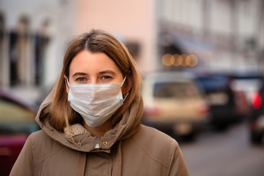

# 
 Face Mask Classifier

  

Face Mask Classifier, Here we are implementing Deep Learning Classification Project in Tensorflow and Keras to classifies the Person with Mask and without Mask.

We can get huge dataset from Kaggle to train FaceMask Classification Model as two folders like with mask and without mask.

I preprocessed the images and changed names to 0_(i).jpg for with mask and 1_(i).jpg for without mask.(here i from 0 to len(dataset)) in one single folder.
By this we can get labels easily while training, And no need to create another csv file for labels.

Coming to Tensorflow, I used normal network architecture to train 5000 and test 1000 images with (64,64,3) size for faster training. we can use same (224,224,3) size if we have GPU based system.

I used BatchNormalization to rescaling, reshifting and train our model faster and used DropOut layer to Regularise the dataset.   

I Used ReLu Activation Function after BatchNormalization layer. To Calculate Cross entropy I used Sigmoid Cross Entropy and Adam for Optimising. I Trained 6000 image dataset in 10 epochs with 20 batch size. In Average it is processed in 75 sec for one epoch and got 100% accuracy for both train and test.

Coming to ResNet, This is a 50 layer Network Architecture with MaxPooling , AveragePooling , BacthNormalisation, ReLu Activation Function and final layer with Softmax. To Calculate Cross Entropy I Used Sparse Categorical Crossentropy and Adam for Optimising. I Trained 6000 image dataset in 10 epochs with 60 batch size.
In Average it is processed in 870 sec for one epoch and got 100% accuracy for both train and test.

### DataSet Source :
 (https://www.kaggle.com/pranavsingaraju/facemask-detection-dataset-20000-images#__sid=js0)
